# Infra Drills

Real-world AWS, Kubernetes, and GitLab CI/CD break-fix challenges that run entirely on your machine. Zero cloud costs, no signup.

[![Live][badge-site]][url-site]
[![Makefile][badge-make]][url-make]
[![Shell][badge-shell]][url-shell]
[![Claude Code][badge-claude]][url-claude]
[![License][badge-license]](LICENSE)

[badge-site]:    https://img.shields.io/badge/live_site-0063e5?style=for-the-badge&logo=googlechrome&logoColor=white
[badge-make]:    https://img.shields.io/badge/Makefile-427819?style=for-the-badge&logo=gnu&logoColor=white
[badge-shell]:   https://img.shields.io/badge/Shell-4EAA25?style=for-the-badge&logo=gnubash&logoColor=white
[badge-claude]:  https://img.shields.io/badge/Claude_Code-CC785C?style=for-the-badge&logo=anthropic&logoColor=white
[badge-license]: https://img.shields.io/badge/license-MIT-404040?style=for-the-badge

[url-site]:   https://infradrills.neorgon.com/
[url-make]:   #
[url-shell]:  #
[url-claude]: https://claude.ai/code

---

Hands-on troubleshooting simulations for AWS, Kubernetes, and GitLab CI/CD.

No cloud costs — everything runs locally with LocalStack, Minikube, and gitlab-ci-local.

Three goals:

- Learn from challenges you haven’t encountered yet.
- Discover what you don’t know.
- Double as interview challenges.

Online course labs rarely throw curveballs. These cases expose the gaps that courses skip.

More about this at the [Curve Ball Approach](#the-curve-ball-approach) section.

 

## Solutions

Except to use Docker!

- [AWS Drills](./aws/README.md): using [LocalStack](https://docs.localstack.cloud/).
    - The folders follow the pattern `SERVICE-NUMBER-SHORT-TITLE`.
    - Solutions are in README format based on the name of the challenges (folders).
- [Kubernetes Drills](./kubernetes/README.md): using Minikube.
    - `k8s-` prefix: Generic Kubernetes (works on any cluster — minikube, kind, etc.)
    - `eks-` prefix: AWS EKS-specific (ALB ingress, IRSA, Secrets Manager CSI, etc.)
- [GitLab CI/CD Drills](./gitlab/README.md): using [gitlab-ci-local](https://github.com/firecow/gitlab-ci-local).
    - Pipelines run locally without a GitLab instance.
- [Ticket Triage](./triage/README.md): simulated support tickets across AWS, K8s, and GitLab.
    - Read the ticket, form a hypothesis, diagnose, find the root cause.

 

### Templates

- Docker
- Gitlab
- Terraform

## Architecture

---

## Drills structure

Prioritize real cases based on your own experience. Things that made you think "Wow, I'm glad I know how to do that!" or "If someone can figure this out, I'm hiring them!"

- 🔎 **Problem/Request**: A thing that happened to you or a request from a user.
    - Optional Sections:
        - Context: Information that can help you understand the problem or request.
        - Hint: You may provide some clues to help the player solve the problem.
- 🧪 **Validation**: What does success look like? What command should we run to validate?
- 💉 **Solution**: Links to the solutions README.
    - File: linked like this `[Solution](../solutions/TYPE/SERVICE-NUMBER-TITLE.md)`.
    - Optional Sections:
        - Common Mistakes: assumptions or other things.
        - Additional Resources: links to explain more behind the issue.

 

## The curve ball approach

Running Chaos Engineering in your company each time a new member starts on-call duties is impractical, and waiting for something to break is too slow.

This approach is a close second.

- 1️⃣ Limited Exposure:
    - Once a project passes the implementation phase, you will get less experience because the scope will consist mainly of providing support or, at best, occasional new features.
    - Unless you actively try to dig and find answers about how and why someone designed the thing you support. You will probably miss most of the nitty-gritty details.

- 2️⃣ Knowledge Gaps:
    - While your company might document past issues, reading static documentation about problem-free systems is hardly engaging or educational. These simulations serve as "live documentation," allowing you to learn by doing.
    - You shouldn't have to wait for something to break to realize that you have knowledge gaps. Stop it, get some help.

- 3️⃣ Interview Challenges:
    - Sometimes, you haven't had the chance to work with a particular technology, but you have the skills to get up to speed—this is for you.

 

## Contributing

Found a bug or have a suggestion? Open an issue or submit a pull request.

---

  Part of <a href="https://neorgon.com">Neorgon</a>

